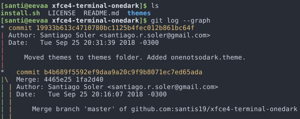

# OneDark theme for xfce4-terminal

## How to install

Just run the `install.sh` script.

Don't run it as root!

## Acknowledments

This repo is a fork of [https://aur.archlinux.org/xfce-terminal-onedark.git]().

The install script is a modified copy from:
[netzverweigerer/xfce4-terminal-colorschemes](https://github.com/netzverweigerer/xfce4-terminal-colorschemes).
